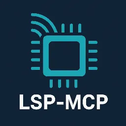
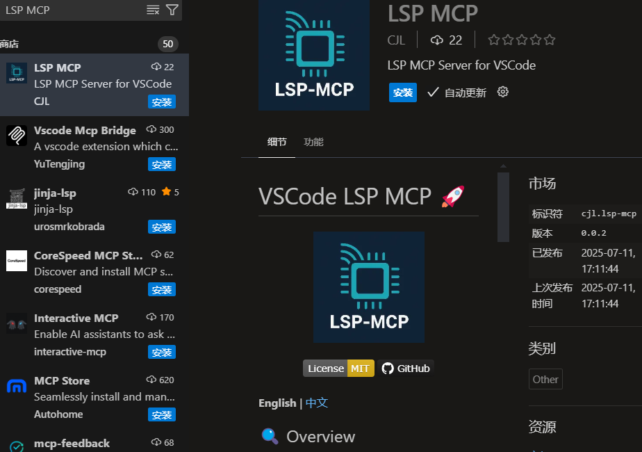
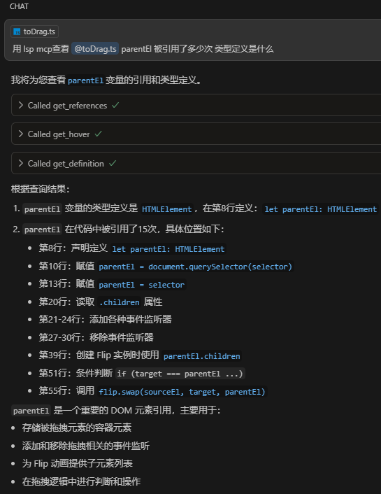

# VSCode LSP MCP

<p align="center">
  
</p>

<p align="center">
  <a href="https://marketplace.visualstudio.com/items?itemName=CJL.lsp-mcp">
    
  </a>
  <a href="https://marketplace.visualstudio.com/items?itemName=CJL.lsp-mcp">
    
  </a>
  <a href="https://marketplace.visualstudio.com/items?itemName=CJL.lsp-mcp">
    
  </a>
  <a href="https://github.com/beixiyo/vsc-lsp-mcp">
    
  </a>
  
  
</p>

<p align="center">
  <a href="./README.md">English</a> | <a href="./README.zh-CN.md">中文</a>
</p>

## 🔍 Overview

VSCode LSP MCP is a Visual Studio Code extension that exposes Language Server Protocol (LSP) features through the Model Context Protocol (MCP).

**Extension ID**: `cjl.lsp-mcp` — open Extensions (`Ctrl+Shift+X` / `Cmd+Shift+X`) and search for **cjl.lsp-mcp** to find this plugin precisely.

This allows AI assistants and external tools to utilize VSCode's powerful language intelligence capabilities without direct integration.




<a href="https://glama.ai/mcp/servers/@beixiyo/vsc-lsp-mcp">
  
</a>

### 🌟 Why This Extension?

Large language models like Claude and Cursor struggle to understand your codebase accurately because:

- They rely on regex patterns to find symbols, leading to false matches
- They can't analyze import/export relationships properly
- They don't understand type hierarchies or inheritance
- They have limited code navigation capabilities

This extension bridges that gap, providing AI tools with the same code intelligence that VSCode uses internally!

## ⚙️ Features

- 🔄 **LSP Bridge**: Converts LSP features into MCP tools
- 🤖 **VS Code Copilot integration**: Registers the local MCP server directly with VS Code Chat / Copilot
- 🔌 **Multi-Instance Broker**: One stable MCP endpoint discovers and routes requests across all open VS Code windows
- 🧠 **15 LSP operations** covering navigation (definition, declaration, type definition, implementation, references), documentation (hover, signature help, completions), structure (document/workspace symbols, call hierarchy), and manipulation (rename)
- ☕ **Java dependency source**: Get decompiled Java class source via jdt:// URI (from jdtls), so AI can read library implementations
- 📄 **Dual output format**: JSON for machine processing, Markdown for LLM-friendly reading

## 🛠️ Exposed MCP Tools

| Tool | Description |
|------|-------------|
| `health` | Report the shared broker status |
| `list_instances` | List active VS Code windows, workspace roots, and instance IDs |
| `execute_lsp` | Execute an LSP operation in an explicitly selected or automatically matched instance |
| `rename_resource` | Rename a workspace file or directory in the matching instance |

### LSP operations

| Operation | Description |
|-----------|-------------|
| `hover` | Get hover information (documentation, type, etc.) at a position |
| `definition` | Get the definition location of a symbol |
| `declaration` | Get the declaration location of a symbol |
| `type_definition` | Get the type definition location of a symbol |
| `implementation` | Get the implementation location(s) of a symbol |
| `references` | Find all references to a symbol |
| `completions` | Get intelligent code completion suggestions |
| `signature_help` | Get signatures and active-parameter information at a call site |
| `document_symbols` | Get the symbol outline (tree) of a document |
| `workspace_symbols` | Search for symbols across the entire workspace by query |
| `class_file_contents` | Get decompiled Java class source via jdt:// URI (from jdtls), to read library/dependency implementations |
| `rename` | Rename a symbol across the workspace |
| `symbol_at_position` | Get symbol metadata (name, kind, range) at a position |
| `incoming_calls` | Find all callers of a symbol |
| `outgoing_calls` | Find all callees (calls made by) a symbol |

All operations are invoked through the single `execute_lsp` MCP tool with a unified input format:
- `operation` — which LSP operation to execute
- `uri` — file path or URI string (supports both plain paths and `file://`/`jdt://` URIs)
- `line` — line number (**1-based**, matching editor display). Required for position-dependent operations
- `character` — character offset (**1-based**, matching editor display). Required for position-dependent operations
- `newName` — required only for `rename`
- `query` — required only for `workspace_symbols`
- `instanceId` — optional instance returned by `list_instances`; takes precedence over automatic path routing

> **1-based positions**: Both input and output use 1-based line/character values, matching what your editor displays. VS Code shows `Ln 9, Col 16` → pass `line: 9, character: 16`. Output positions can be used directly as input for the next call — no conversion needed.

### Multi-instance routing

The extension starts one lightweight internal endpoint per VS Code window and registers it with a shared broker. External clients keep using a single MCP URL. The broker selects an instance in this order:

1. Exact `instanceId`, when provided
2. Longest workspace-root prefix matching the input file path
3. The only active instance, when no path can identify one

If two windows open the same project, routing is intentionally rejected as ambiguous until the caller passes `instanceId`. The registry contains no public credentials and stale window records expire automatically.

The first multi-instance release supports local desktop workspaces and `file:` resources. Remote SSH, WSL, Dev Containers, and virtual workspaces are not yet advertised as supported.

### Workspace tools (Unreleased)

| Tool | Description |
|------|-------------|
| `rename_resource` | Rename a file or directory through VS Code's `WorkspaceEdit` API. Accepts `oldUri`, `newUri`, and optional `overwrite` parameters. |

> **Known issue:** On VS Code 1.115, resources are renamed successfully, but TypeScript import paths may not update. Check stale paths and run type checking afterward.

## 📋 Configuration

<!-- configs -->

| Key                           | Description                                                                                                                                           | Type      | Default |
| ----------------------------- | ----------------------------------------------------------------------------------------------------------------------------------------------------- | --------- | ------- |
| `lsp-mcp.enabled`             | Enable or disable the LSP MCP server.                                                                                                                 | `boolean` | `true`  |
| `lsp-mcp.port`                | Preferred port for the shared MCP broker.                                                                                                             | `number`  | `9527`  |
| `lsp-mcp.cors.enabled`        | Enable CORS for browser-based MCP clients. Keep disabled for native clients.                                                                          | `boolean` | `false` |
| `lsp-mcp.cors.allowOrigins`   | Allowed origins for CORS. Use `*` to allow all origins, or provide a comma-separated list of origins (e.g., `http://localhost:3000,http://localhost:5173`). | `string`  | `*`     |
| `lsp-mcp.cors.withCredentials` | Whether to allow credentials (cookies, authorization headers) in CORS requests.                                                                       | `boolean` | `false` |
| `lsp-mcp.cors.exposeHeaders`   | Headers that browsers are allowed to access. Provide a comma-separated list of headers (e.g., `Mcp-Session-Id`).                      | `string`  | `Mcp-Session-Id` |
| `lsp-mcp.maxResults`           | Maximum number of items returned for list-type results (completions, workspace_symbols, etc.). Prevents excessive token usage. | `number` | `200` |
| `lsp-mcp.outputFormat`         | Output format for LSP operation results. `json` for machine-readable JSON, `markdown` for LLM-friendly Markdown.                     | `string`  | `json` |
 
<!-- configs -->

## 🔗 Integration with AI Tools

### VS Code Copilot

No `mcp.json` setup is required. After the extension starts, it registers the local LSP MCP server with VS Code through an MCP server definition provider.

Use **MCP: List Servers** or the chat tools picker in VS Code to enable or manage the **LSP MCP Server**.

### Cursor

Config file: `~/.cursor/mcp.json` (e.g. `%USERPROFILE%\.cursor\mcp.json` on Windows)

```json
{
  "mcpServers": {
    "lsp-mcp": {
      "url": "http://127.0.0.1:9527/mcp"
    }
  }
}
```

### OpenCode

Config file: `~/.config/opencode/opencode.jsonc`

```json
{
  "mcp": {
    "lsp-mcp": {
      "type": "remote",
      "url": "http://127.0.0.1:9527/mcp",
      "enabled": true
    }
  }
}
```

### Claude Code

Config file: `~/.claude.json`

```json
{
  "mcpServers": {
    "lsp-mcp": {
      "type": "http",
      "url": "http://127.0.0.1:9527/mcp"
    }
  }
}
```

### Gemini | IFlow

Config file: `~/.gemini/settings.json`

```json
{
  "mcpServers": {
    "lsp-mcp": {
      "type": "streamable-http",
      "httpUrl": "http://127.0.0.1:9527/mcp"
    }
  }
}
```

### Codex

Config file: `~/.codex/config.toml`

```toml
[mcp_servers.lsp-mcp]
url = "http://127.0.0.1:9527/mcp"
```

### Roo Code

```json
{
  "mcpServers": {
    "lsp-mcp": {
      "type": "streamable-http",
      "url": "http://127.0.0.1:9527/mcp",
      "disabled": false
    }
  }
}
```

---

## 💻 Development

- Clone the repository
- Run `pnpm install`
- Run `pnpm run update` to generate metadata
- Press `F5` to start debugging
